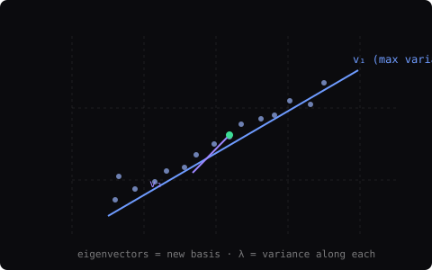

PCA is usually taught as 'reducing dimensions', which makes it sound like a compression trick. The more useful framing: PCA is a change of basis, followed by a projection.

## The setup

Given data points in d dimensions, PCA finds the orthonormal basis in which the data's variance is maximally aligned with the first axes. Formally, it solves for the eigenvectors of the covariance matrix:

```text
C = XᵀX / n
C v = λ v

λ₁ ≥ λ₂ ≥ … ≥ λd
```

Each eigenvector v is a direction in the original feature space; λ is the variance of the data along that direction. Projecting X onto the top-k eigenvectors keeps the k directions with the most variance — that's all 'keeping 95% of the variance' means.

## Why this matters

- It decorrelates features (new axes are orthogonal).
- The projection is the linear map with minimum reconstruction error for a given k — provably.
- It's also the whitening step behind many representation pipelines.

> PCA does NOT care about class structure. Two heavily overlapping classes can be preserved perfectly while a tiny separating axis gets thrown away. Use it to compress signal you already trust, not to discover what matters.

In practice I reach for PCA on tabular data before embeddings, to sanity-check that my features carry variance that tracks meaning — and occasionally as a baseline against 'proper' learned representations to prove they're actually learning something PCA can't.


